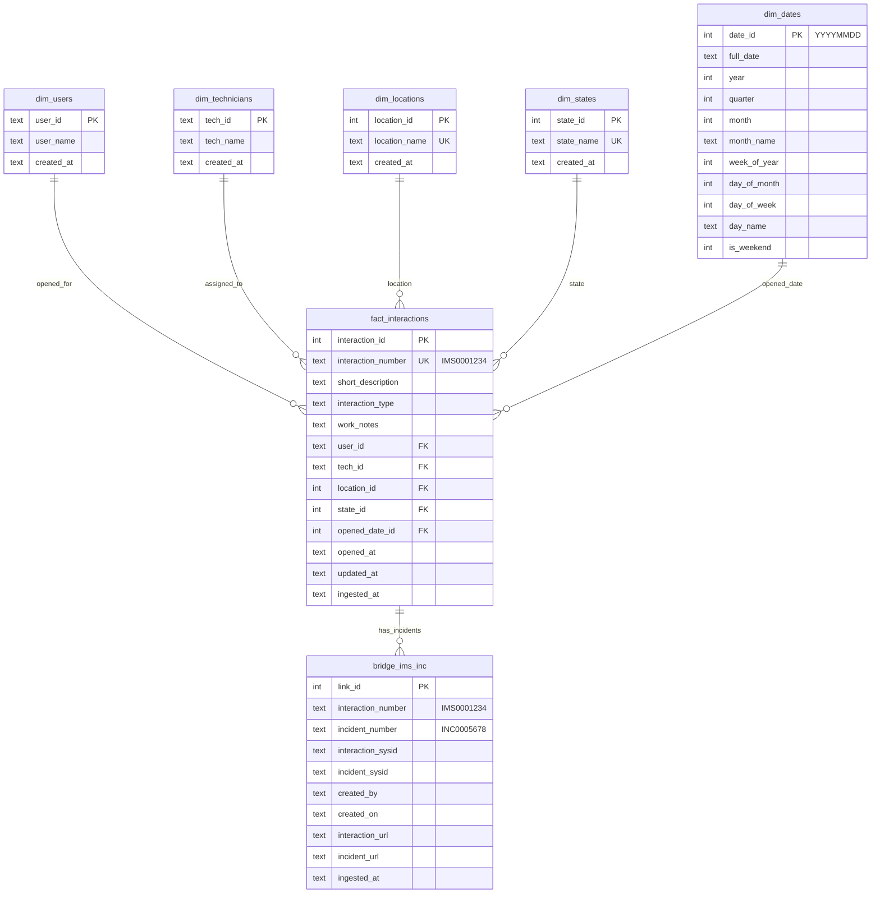

# Star Schema Documentation

This document describes the normalized data warehouse schema used for IT support interaction analytics.

## Entity Relationship Diagram



## Schema Overview

### Dimension Tables

| Table | Purpose | Key |
|-------|---------|-----|
| `dim_users` | End users who opened interactions | `user_id` (natural key) |
| `dim_technicians` | IT support staff assigned to tickets | `tech_id` (natural key) |
| `dim_locations` | Physical office locations | `location_id` (surrogate key) |
| `dim_states` | Ticket status values | `state_id` (surrogate key) |
| `dim_dates` | Date dimension for time-based analytics | `date_id` (YYYYMMDD format) |

### Fact Table

**`fact_interactions`** - Central fact table containing one row per support ticket (interaction).

Measures and metrics derived from this table:
- Ticket volume by time period
- Technician workload distribution
- Resolution rates by state
- Location-based support demand

### Bridge Table

**`bridge_ims_inc`** - Links interactions to their associated incidents.

This table supports:
- Conversion rate analysis (IMS → INC)
- Incident tracking per interaction
- URL generation for ticket navigation

## Data Flow

```
┌─────────────────┐    ┌─────────────────┐    ┌─────────────────┐
│  interactions   │    │   ims_inc.csv   │    │  sysid.json     │
│     .csv        │    │                 │    │                 │
└────────┬────────┘    └────────┬────────┘    └────────┬────────┘
         │                      │                      │
         ▼                      ▼                      ▼
┌─────────────────────────────────────────────────────────────────┐
│                        ingest.py                                 │
│  ┌──────────┐  ┌──────────────┐  ┌──────────────────────────┐  │
│  │ Extract  │→ │  Transform   │→ │         Load             │  │
│  │ (CSV/    │  │ (Parse,      │  │ (Insert into star        │  │
│  │  JSON)   │  │  Normalize)  │  │  schema tables)          │  │
│  └──────────┘  └──────────────┘  └──────────────────────────┘  │
└─────────────────────────────────────────────────────────────────┘
                                │
                                ▼
┌─────────────────────────────────────────────────────────────────┐
│                     interactions.db                              │
│  ┌───────────────────────────────────────────────────────────┐  │
│  │  Dimension Tables          │   Fact & Bridge Tables       │  │
│  │  ─────────────────         │   ────────────────────       │  │
│  │  dim_users                 │   fact_interactions          │  │
│  │  dim_technicians           │   bridge_ims_inc             │  │
│  │  dim_locations             │                              │  │
│  │  dim_states                │                              │  │
│  │  dim_dates                 │                              │  │
│  └───────────────────────────────────────────────────────────┘  │
└─────────────────────────────────────────────────────────────────┘
```

## Key Design Decisions

### 1. Star Schema vs Normalized
We chose a star schema for:
- Simplified analytical queries (fewer JOINs)
- Better query performance for aggregations
- Intuitive structure for business users

### 2. Natural vs Surrogate Keys
- **Natural keys** for users/technicians (`user_id`, `tech_id`) - stable identifiers
- **Surrogate keys** for locations/states - allows for changes without FK updates

### 3. Date Dimension
Pre-computed date attributes enable:
- Efficient time-based grouping (by week, month, quarter)
- Weekend/weekday analysis
- Fiscal calendar support (extensible)

### 4. Bridge Table Pattern
The `bridge_ims_inc` table handles the many-to-many relationship between interactions and incidents, enabling:
- Flexible incident linking
- URL storage for navigation
- Audit trail via timestamps

## Example Queries

### Daily Interaction Volume
```sql
SELECT 
    d.full_date,
    d.day_name,
    COUNT(*) as interactions
FROM fact_interactions f
JOIN dim_dates d ON f.opened_date_id = d.date_id
GROUP BY d.date_id
ORDER BY d.full_date;
```

### Technician Workload
```sql
SELECT 
    t.tech_name,
    COUNT(*) as tickets,
    COUNT(DISTINCT f.opened_date_id) as days_active
FROM fact_interactions f
JOIN dim_technicians t ON f.tech_id = t.tech_id
GROUP BY f.tech_id
ORDER BY tickets DESC;
```

### Conversion Rate (IMS → INC)
```sql
SELECT 
    t.tech_name,
    COUNT(DISTINCT f.interaction_number) as total_ims,
    COUNT(DISTINCT b.incident_number) as total_inc,
    ROUND(100.0 * COUNT(DISTINCT b.incident_number) / COUNT(DISTINCT f.interaction_number), 2) as conversion_pct
FROM fact_interactions f
JOIN dim_technicians t ON f.tech_id = t.tech_id
LEFT JOIN bridge_ims_inc b ON f.interaction_number = b.interaction_number
GROUP BY f.tech_id
HAVING total_ims >= 50
ORDER BY conversion_pct DESC;
```
